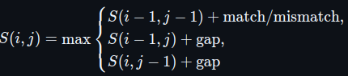
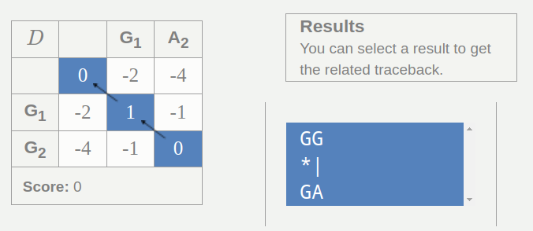
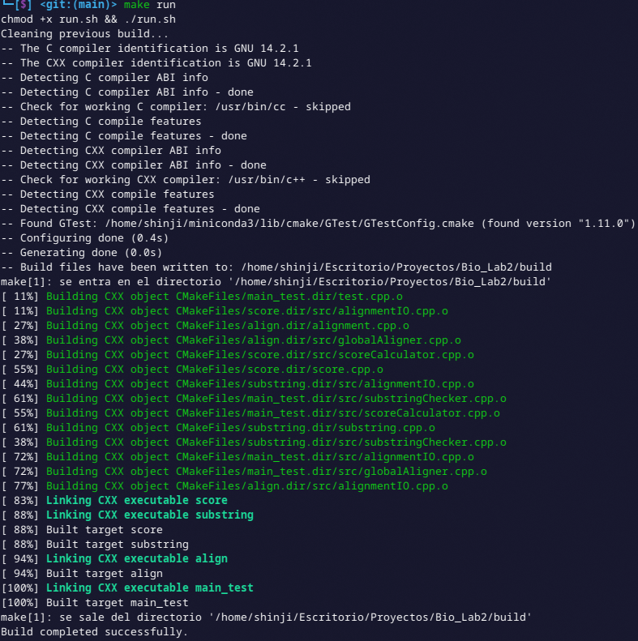
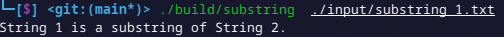
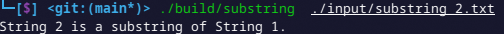
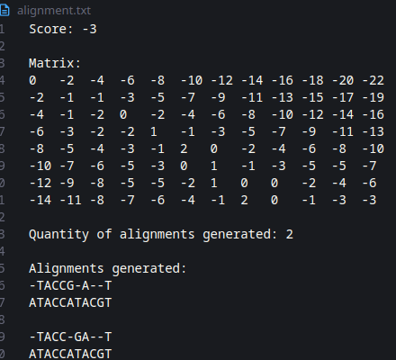
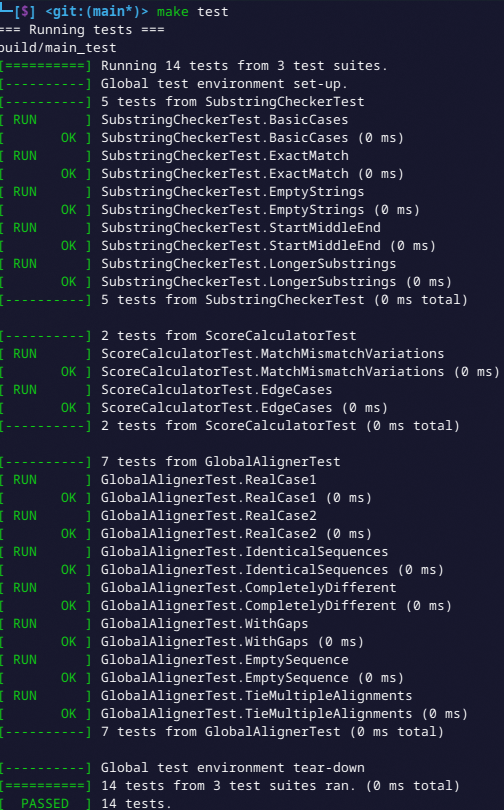

# Alineamiento Global

De Braulio Nayap Maldonado Casilla

## Introducción

El **alineamiento global**, también conocido como alineamiento de Needleman-Wunsch, es una técnica utilizada para comparar dos secuencias completas, como ADN o proteínas, encontrando la mejor correspondencia posible entre ellas. Matemáticamente, se basa en la programación dinámica con la fórmula:



donde (i, j) es el puntaje óptimo hasta los caracteres i y j, y se consideran coincidencias, desajustes y penalizaciones por espacios. A continuación, se muestra un ejemplo de matriz y resultado del alineamiento.



## Implementación

### 1. Substring

La clase `SubstringChecker` es la encargada de validar si una cadena es substring de otra cadena.

```cpp
class SubstringChecker
{
public:
    static std::vector<int> buildPrefixTable(const std::string &pattern);
    static bool isSubstring(const std::string &text, const std::string &pattern);
};
```

La función `buildPrefixTable` recibe un patrón y construye una tabla `lps` que indica, para cada posición, la longitud del prefijo más largo que también es sufijo. Esto permite optimizar la búsqueda del patrón evitando comparaciones innecesarias. Recorre el patrón desde la segunda posición y llena `lps` comparando caracteres. Si hay coincidencia, incrementa el contador y actualiza la tabla; si no, retrocede buscando otra coincidencia. Al final, devuelve el vector `lps`.

```cpp
std::vector<int> SubstringChecker::buildPrefixTable(const std::string &pattern)
{
    int m = pattern.size();
    std::vector<int> lps(m, 0);
    int len = 0;
    for (int i = 1; i < m;)
    {
        if (pattern[i] == pattern[len])
            lps[i++] = ++len;
        else if (len != 0)
            len = lps[len - 1];
        else
            lps[i++] = 0;
    }
    return lps;
}
```

La función `isSubstring` recibe dos cadenas: el texto y el patrón a buscar. Devuelve `true` si el patrón está vacío y `false` si el texto lo está. Luego construye la tabla `lps` y realiza la búsqueda comparando caracteres con dos índices. Si encuentra coincidencias completas, retorna `true`; si hay desajustes, usa `lps` para evitar reiniciar desde cero. Si termina el texto sin hallarlo, devuelve `false`.

```cpp
bool SubstringChecker::isSubstring(const std::string &text, const std::string &pattern)
{
    if (pattern.empty())
        return true;
    if (text.empty())
        return false;
    int n = text.size();
    int m = pattern.size();
    std::vector<int> lps = buildPrefixTable(pattern);
    int i = 0, j = 0;
    while (i < n)
    {
        if (text[i] == pattern[j])
        {
            i++;
            j++;
            if (j == m)
                return true;
        }
        else if (j != 0)
            j = lps[j - 1];
        else
            i++;
    }
    return false;
}
```

### 2. Score

La clase `ScoreCalculator` calcula un puntaje de similitud entre dos cadenas. Usa dos valores: `same` para coincidencias y `diff` para diferencias, configurables desde el constructor. Por defecto, suma 1 si los caracteres coinciden y resta 2 si no. Esto permite ajustar cómo se mide la similitud entre las cadenas.

```cpp
class ScoreCalculator
{
private:
    int same, diff;

public:
    ScoreCalculator(int same = 1, int diff = -2) : same(same), diff(diff) {}
    int calculateScore(const std::string &a, const std::string &b) const;
};
```

La función `calculateScore` compara carácter por carácter dos cadenas, hasta su longitud mínima. Si los caracteres coinciden, suma `same`; si no, suma `diff`. Al final, devuelve el puntaje total, indicando cuán similares son las cadenas según esos valores.

```cpp
int ScoreCalculator::calculateScore(const std::string &a, const std::string &b) const
{
    int score = 0;
    size_t len = std::min(a.size(), b.size());
    for (size_t i = 0; i < len; ++i)
    {
        if (a[i] == b[i])
            score += same;
        else
            score += diff;
    }
    return score;
}
```

### 3. Alineamiento Global

La clase `GlobalAligner` implementa un alineamiento global entre dos secuencias. Usa una matriz de puntajes para decidir el mejor alineamiento considerando coincidencias, diferencias y espacios (gaps). El constructor recibe los valores para cada uno. La función `align` realiza el cálculo completo y devuelve el puntaje, la matriz y los alineamientos.

```cpp
class GlobalAligner
{
private:
    int matchScore;
    int mismatchPenalty;
    int gapPenalty;

    void initializeMatrix(std::vector<std::vector<int>> &dp, int m, int n) const;
    void fillMatrix(std::vector<std::vector<int>> &dp, const std::string &s1, const std::string &s2, int m, int n) const;
    std::vector<std::pair<std::string, std::string>> backtrackAlignments(
        const std::vector<std::vector<int>> &dp,
        const std::string &s1, const std::string &s2,
        int m, int n) const;
    struct Aligned
    {
        std::vector<char> a1, a2;
    };
    void dfs(const std::vector<std::vector<int>> &dp,
             const std::string &seq1, const std::string &seq2,
             int i, int j, Aligned &aligned,
             std::vector<std::pair<std::string, std::string>> &alignments) const;

public:
    GlobalAligner(int match = 1, int mismatch = -1, int gap = -2);
    AlignmentResult align(const std::string &seq1, const std::string &seq2);
};
```

El constructor `GlobalAligner` recibe los puntajes para coincidencia, diferencia y espacios, y los asigna a sus variables internas para ser usados en el algoritmo, permitiendo configurar las reglas del alineamiento según se requiera.

```cpp
GlobalAligner::GlobalAligner(int match, int mismatch, int gap)
    : matchScore(match), mismatchPenalty(mismatch), gapPenalty(gap) {}
```

La función `align` realiza el alineamiento global. Crea una matriz `dp` con los tamaños de las secuencias y la inicializa con penalizaciones por gaps. Luego la llena considerando el mejor puntaje en cada celda y, al final, usa `backtrackAlignments` para obtener todos los alineamientos óptimos. Devuelve el puntaje final, la matriz y los alineamientos.

```cpp
AlignmentResult GlobalAligner::align(const std::string &seq1, const std::string &seq2)
{
    int m = seq1.size(), n = seq2.size();
    std::vector<std::vector<int>> dp(m + 1, std::vector<int>(n + 1));
    initializeMatrix(dp, m, n);
    fillMatrix(dp, seq1, seq2, m, n);
    auto alignments = backtrackAlignments(dp, seq1, seq2, m, n);
    int finalScore = dp[m][n];
    return {finalScore, dp, alignments};
}
```

La función `initializeMatrix` recibe la matriz `dp` y sus dimensiones y prepara la primera fila y columna inicializando las penalizaciones acumuladas por gaps, es decir, si una cadena está alineada con espacios en la otra al inicio, esos espacios acumulan penalizaciones crecientes.

```cpp
void GlobalAligner::initializeMatrix(std::vector<std::vector<int>> &dp, int m, int n) const
{
    for (int i = 0; i <= m; ++i)
        dp[i][0] = i * gapPenalty;
    for (int j = 0; j <= n; ++j)
        dp[0][j] = j * gapPenalty;
}
```

La función `fillMatrix` recorre toda la matriz a partir de la posición (1,1) y calcula el puntaje máximo para cada celda considerando tres opciones: el puntaje en diagonal más la coincidencia o diferencia según los caracteres actuales, el puntaje de la celda de arriba más la penalización por gap, y el puntaje de la celda izquierda más la penalización por gap. De este modo, se determina el mejor puntaje acumulado para cada subalineamiento.

```cpp
void GlobalAligner::fillMatrix(std::vector<std::vector<int>> &dp,
                               const std::string &seq1, const std::string &seq2,
                               int m, int n) const
{
    for (int i = 1; i <= m; ++i)
        for (int j = 1; j <= n; ++j)
        {
            int scoreDiag = dp[i - 1][j - 1] + ((seq1[i - 1] == seq2[j - 1]) ? matchScore : mismatchPenalty);
            int scoreUp = dp[i - 1][j] + gapPenalty;
            int scoreLeft = dp[i][j - 1] + gapPenalty;
            dp[i][j] = std::max({scoreDiag, scoreUp, scoreLeft});
        }
}
```

La función `backtrackAlignments` reconstruye todos los alineamientos óptimos desde la última celda de la matriz de puntajes. Usa una búsqueda en profundidad (`dfs`) que recorre hacia atrás las posibles rutas que generaron el puntaje, agregando caracteres o gaps según el movimiento, hasta formar las secuencias alineadas.

```cpp
std::vector<std::pair<std::string, std::string>>
GlobalAligner::backtrackAlignments(const std::vector<std::vector<int>> &dp,
                                   const std::string &seq1, const std::string &seq2,
                                   int m, int n) const
{
    std::vector<std::pair<std::string, std::string>> alignments;
    Aligned initial;
    dfs(dp, seq1, seq2, m, n, initial, alignments);
    return alignments;
}
```

La función `dfs` explora recursivamente la matriz desde una posición dada. Si llega a (0,0), invierte y guarda las secuencias construidas. En cada paso evalúa si el movimiento fue por gap o por coincidencia/diferencia, agregando el carácter o gap correspondiente y continuando la búsqueda.

```cpp
void GlobalAligner::dfs(const std::vector<std::vector<int>> &dp,
                        const std::string &seq1, const std::string &seq2,
                        int i, int j, Aligned &aligned,
                        std::vector<std::pair<std::string, std::string>> &alignments) const
{
    if (i == 0 && j == 0)
    {
        std::string s1(aligned.a1.rbegin(), aligned.a1.rend());
        std::string s2(aligned.a2.rbegin(), aligned.a2.rend());
        alignments.emplace_back(s1, s2);
        return;
    }

    if (i > 0 && dp[i][j] == dp[i - 1][j] + gapPenalty)
    {
        aligned.a1.push_back(seq1[i - 1]);
        aligned.a2.push_back('-');
        dfs(dp, seq1, seq2, i - 1, j, aligned, alignments);
        aligned.a1.pop_back();
        aligned.a2.pop_back();
    }
    if (j > 0 && dp[i][j] == dp[i][j - 1] + gapPenalty)
    {
        aligned.a1.push_back('-');
        aligned.a2.push_back(seq2[j - 1]);
        dfs(dp, seq1, seq2, i, j - 1, aligned, alignments);
        aligned.a1.pop_back();
        aligned.a2.pop_back();
    }
    if (i > 0 && j > 0)
    {
        int score = (seq1[i - 1] == seq2[j - 1]) ? matchScore : mismatchPenalty;
        if (dp[i][j] == dp[i - 1][j - 1] + score)
        {
            aligned.a1.push_back(seq1[i - 1]);
            aligned.a2.push_back(seq2[j - 1]);
            dfs(dp, seq1, seq2, i - 1, j - 1, aligned, alignments);
            aligned.a1.pop_back();
            aligned.a2.pop_back();
        }
    }
}
```

### 4. Lectura y Escritura de Datos

La clase `AlignmentIO` es la encargada de leer archivos que contengan dos cadenas y de almacenar los datos del alineamiento en un txt.

```cpp
class AlignmentIO
{
public:
    static std::pair<std::string, std::string> loadSequences(const std::string &filename);
    static void writeToFile(const std::string &filename,
                            int score,
                            const std::vector<std::vector<int>> &matrix,
                            const std::vector<std::pair<std::string, std::string>> &alignments);
};
```

La función `loadSequences` abre un archivo de texto, lee dos líneas que contienen las secuencias y las devuelve como un par. Si el archivo no se puede abrir o leer, lanza una excepción. Si todo va bien, retorna las dos cadenas correspondientes a cada línea.

```cpp
std::pair<std::string, std::string> AlignmentIO::loadSequences(const std::string &filename)
{
    std::ifstream file(filename);
    if (!file)
        throw std::runtime_error("Could not open file: " + filename);
    std::string line1, line2;
    if (!std::getline(file, line1) || !std::getline(file, line2))
        throw std::runtime_error("Error reading lines from file: " + filename);
    return {line1, line2};
}
```

La función `writeToFile` guarda en un archivo los resultados del alineamiento: el puntaje, la matriz de puntuación y los alineamientos generados. Si no puede abrir el archivo, muestra un error. Si lo logra, escribe el puntaje, la matriz en formato tabulado, la cantidad de alineamientos y luego cada uno de ellos con saltos de línea para facilitar su lectura.

```cpp
void AlignmentIO::writeToFile(const std::string &filename,
                              int score,
                              const std::vector<std::vector<int>> &matrix,
                              const std::vector<std::pair<std::string, std::string>> &alignments)
{
    std::ofstream out(filename);
    if (!out)
    {
        std::cerr << "Could not open file: " << filename << "\n";
        return;
    }
    out << "Score: " << score << "\n\n";
    out << "Matrix:\n";
    for (const auto &row : matrix)
    {
        for (int val : row)
            out << val << "\t";
        out << "\n";
    }
    out << "\nQuantity of alignments generated: "
        << alignments.size() << "\n\n";
    out << "Alignments generated:\n";
    for (const auto &[a1, a2] : alignments)
        out << a1 << "\n"
            << a2 << "\n\n";
}
```

## Ejecución y Resultados

Para compilar ejecutar:

```bash
make run
```



### 1. Substring

Para ejecutar el programa que verifica si una secuencia es subcadena de otra, se utiliza el siguiente comando:

```bash
./build/substring data.txt
```

**Ejemplo de entrada 1 (contenido de `data.txt`):**

```
CGTA
CGAGGGGTDGATAGACGTA
```

**Salida:**



**Ejemplo de entrada 2 (contenido de `data.txt`):**

```
CGAGGGGTCGATAGACGTA
GGTC
```

**Salida:**



### 2. Score

Este ejecutable calcula la similitud entre dos secuencias según puntuación definida:

```bash
./build/score data.txt
```

**Ejemplo de entrada (contenido de `data.txt`):**

```
ACCCGTAG
ACCAGTTG
```

**Salida:**


### 3. Alineamiento Global

Para ejecutar el algoritmo de alineamiento global, se corre:

```bash
./build/align data.txt
```

**Ejemplo de entrada (contenido de `data.txt`):**

```
ACCCGTAG
ACCAGTTG
```

**Salida generada en archivo `results.txt`:**

- Puntaje final
- Matriz de puntuación tabulada
- Número de alineamientos óptimos generados
- Listado de alineamientos formateados

**Salida:**




### 4. Test

Se implementaron pruebas unitarias utilizando Google Test, abarcando casos de validación y posibles errores en la ejecución de cada módulo. Estas pruebas permiten verificar el comportamiento esperado del sistema bajo distintas condiciones.
Para ejecutarlas, basta con correr el siguiente comando:

```bash
make test
```

**Salida:**



## Conclusiones

La implementación del algoritmo de alineamiento global demostró ser efectiva para encontrar alineamientos óptimos entre dos secuencias, con una complejidad temporal de O(mn), donde _m_ y _n_ son las longitudes de las secuencias. Este comportamiento garantiza resultados precisos incluso en casos con múltiples alineamientos válidos. Además, los métodos complementarios de búsqueda de subcadenas (`substring`) y cálculo de puntuación (`score`) resultaron útiles para validar partes del alineamiento y evaluar la similitud entre secuencias, fortaleciendo el análisis general. La integración de pruebas unitarias permitió asegurar la robustez de cada componente del sistema.

## Author

- **ShinjiMC** - [GitHub Profile](https://github.com/ShinjiMC)

## License

This project is licensed under the MIT License. See the [LICENSE](LICENSE) file for details.
